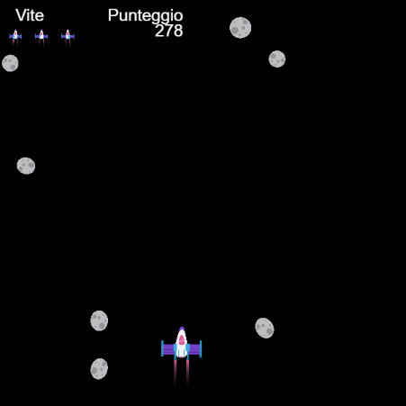

## Migliora il tuo progetto

Se hai più tempo, puoi migliorare il tuo progetto.

{:width="300px"}

Ecco alcune idee che potresti provare:

### Includere una varietà di ostacoli
Puoi aggiungere varietà ai tuoi ostacoli in alcuni modi:
 - Scegli in modo casuale tra più immagini, emoji o funzioni di disegno di ostacoli
 - Regola in modo casuale il colore, la forma o la dimensione degli ostacoli modificando i parametri che li disegnano
 - Anima l'ostacolo aggiungendo una rotazione, un cambio di colore o qualche altra differenza visiva controllata da `frame_count`

### Aggiungi una condizione di vittoria
Puoi far vincere la partita ai giocatori in diversi modi:
 - Raggiungendo un punteggio
 - Raggiungendo un certo livello del gioco

Una volta che hanno vinto, dovresti dirglielo in qualche modo — magari usando `print()` o `text()` e poi interrompere il gioco.

### Dai ai giocatori più di una vita
Aggiungi vite al tuo gioco, per consentire ai giocatori di sopravvivere ad alcune collisioni. Questo è un po' più complicato che fare semplicemente `vite -= 1` ogni volta che si scontrano con qualcosa:
 - Il giocatore può trascorrere più fotogrammi in contatto con un oggetto e quindi perdere più di una vita per una singola collisione — dovrai evitare che ciò accada
 - Avrai anche bisogno di un modo per consentire ai giocatori di sapere quante vite hanno ancora a disposizione, e magari di una sorta di avvertimento che indichi loro quando è giunta l'ultima vita
 - Potresti aggiungere un oggetto che, quando il giocatore si scontra con esso, gli dia una vita extra. Ricorda che dovrai modificare il tuo normale codice di collisione in modo che non sottragga una vita allo stesso tempo!

Ogni progetto di esempio nell'Introduzione ti consente di osservare il codice, ottenere idee e vedere come funzionano.

Il progetto "Schiva gli asteroidi" di seguito ha tutte queste caratteristiche:

**Schiva gli asteroidi**:
<iframe src="https://editor.raspberrypi.org/en/embed/viewer/dodge-asteroids-example" width="600" height="700" frameborder="0" marginwidth="0" marginheight="0" allowfullscreen>
</iframe>

Puoi trovare il progetto Schiva gli asteroidi [qui](https://editor.raspberrypi.org/en/projects/dodge-asteroids-example){:target="_blank"}

Dai un'occhiata ad alcuni progetti Non scontrarti creati dai membri della comunità nella [Non scontrarti - Biblioteca della comunità](https://wke.lt/w/s/KobNfx){:target="_blank"} della Raspberry Pi Foundation.

--- save ---
