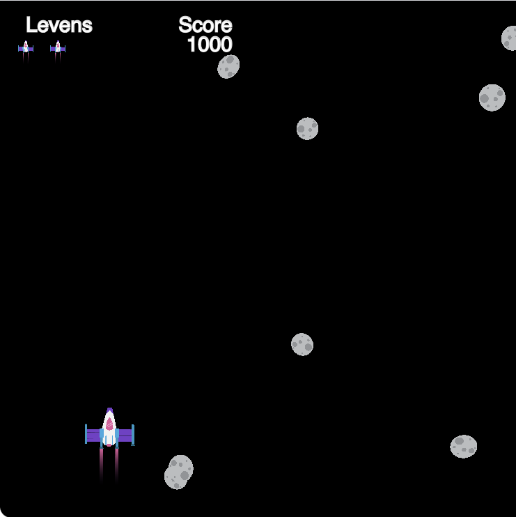

## Wat ga je maken

Bouw een eindeloos rollend renspel waarin je personage obstakels moet ontwijken.

{:width="300px"}
[Skiing cat](https://editor.raspberrypi.org/en/projects/skiing-cat-example){:target="_blank"}

{:width="300px"}
[Don't pop](https://editor.raspberrypi.org/en/projects/dont-pop-example){:target="_blank"}

{:width="300px"}
[Avoid the germs](https://editor.raspberrypi.org/en/projects/avoid-germs-example){:target="_blank"}

{:width="300px"}
[Clean car](https://editor.raspberrypi.org/en/projects/clean-car-example){:target="_blank"}

{:width="300px"}
[Dodge asteroids](https://editor.raspberrypi.org/en/projects/dodge-asteroids-example){:target="_blank"}

